# Day 86 -- GitOps Project: End-to-End CI/CD Pipeline with AI-BankApp

## Task 1: Study the AI-BankApp's GitOps CI Pipeline
Open `.github/workflows/gitops-ci.yml` from the AI-BankApp repo. This is a production-grade GitOps CI pipeline.

**The workflow triggers on:**
```yaml
on:
  push:
    branches: [feat/gitops]
    paths:
      - 'src/**'
      - 'pom.xml'
      - 'Dockerfile'
  workflow_dispatch:
```

It only runs when application code changes (`src/`, `pom.xml`, `Dockerfile`) -- not when Kubernetes manifests change. This prevents infinite loops since the pipeline itself updates manifests.

**The pipeline steps:**

| Step | What it does |
|------|-------------|
| Checkout code | Clones the repo |
| Set up JDK 21 | Installs Java 21 with Maven cache |
| Build with Maven | `./mvnw clean package -DskipTests -B` |
| Run tests | `./mvnw test -B` (non-blocking: `continue-on-error: true`) |
| Set image tag | Uses `git rev-parse --short HEAD` as the tag (e.g., `1c7cb0e`) |
| Login to DockerHub | Authenticates with secrets |
| Build and push image | Pushes `trainwithshubham/ai-bankapp-eks:latest` and `:sha` |
| Update K8s manifest | Uses `sed` to update the image tag in `k8s/bankapp-deployment.yml` |
| Commit updated manifest | Commits the change with `[skip ci]` to avoid re-triggering |

**The critical GitOps step** is the last two:
```yaml
- name: Update Kubernetes deployment manifest
  run: |
    sed -i "s|image: ${{ env.DOCKERHUB_REPO }}:.*|image: ${{ env.DOCKERHUB_REPO }}:${{ steps.tag.outputs.sha_short }}|" k8s/bankapp-deployment.yml

- name: Commit updated manifest
  run: |
    git config user.name "github-actions[bot]"
    git config user.email "github-actions[bot]@users.noreply.github.com"
    git add k8s/bankapp-deployment.yml
    git diff --staged --quiet || git commit -m "ci: update bankapp image to ${{ steps.tag.outputs.sha_short }} [skip ci]"
    git push
```

**Why `[skip ci]`?** Without it, the commit that updates the manifest would trigger the pipeline again, which would update the manifest again -- an infinite loop. `[skip ci]` tells GitHub Actions to ignore this commit.

**The handoff to ArgoCD:**
```
GitHub Actions commits new image tag to k8s/bankapp-deployment.yml
         |
    ArgoCD detects the new commit (within 3 minutes)
         |
    ArgoCD compares: cluster has old image, Git has new image
         |
    ArgoCD syncs: performs a rolling update
         |
    New pods start with the new image, old pods terminate
         |
    Zero downtime deployment complete
```

---

## Task 2: Set Up the Pipeline on Your Fork
To run the full pipeline, you need your own fork with GitHub Secrets.

**1. Fork the repo** (if not done on Day 84):
```
https://github.com/TrainWithShubham/AI-BankApp-DevOps -> Fork
```

**2. Create a DockerHub access token:**
- Go to https://hub.docker.com/settings/security
- Create a new access token with Read/Write permissions
- Note the token

**3. Add GitHub Secrets to your fork:**
- Go to your fork > Settings > Secrets and variables > Actions
- Add these secrets:
  - `DOCKERHUB_USERNAME` -- your DockerHub username
  - `DOCKERHUB_TOKEN` -- the access token from step 2

**4. Update the workflow to push to your DockerHub repo:**
Edit `.github/workflows/gitops-ci.yml` in your fork:
```yaml
env:
  DOCKERHUB_REPO: <your-dockerhub-username>/ai-bankapp-eks
```

**5. Update the ArgoCD Application to watch your fork:**
```bash
argocd app set bankapp --repo https://github.com/<your-username>/AI-BankApp-DevOps.git
```

**6. Update the Kubernetes deployment to pull from your DockerHub:**
Edit `k8s/bankapp-deployment.yml`:
```yaml
image: <your-dockerhub-username>/ai-bankapp-eks:latest
```

Commit and push all changes to your fork's `feat/gitops` branch.

---

## Task 3: Trigger the Full Pipeline
Make a visible code change in the application. Edit a file in `src/`:

For example, edit `src/main/resources/templates/fragments/layout.html` -- change the page title or footer text to include your name:
```html
<!-- Find the title or footer and add your touch -->
<title>AI BankApp - Built by YourName</title>
```

Commit and push:
```bash
git add src/
git commit -m "feat: customize app title"
git push origin feat/gitops
```

**Watch the pipeline:**
1. Go to your fork > Actions tab
2. The "GitOps CI - Build & Push to DockerHub" workflow should be running
3. Watch each step: build -> test -> push -> update manifest -> commit

**After the pipeline completes:**
- Check the last commit on your `feat/gitops` branch -- you should see a commit from `github-actions[bot]` with the message `ci: update bankapp image to <sha> [skip ci]`
- The `k8s/bankapp-deployment.yml` file now has the new image tag

   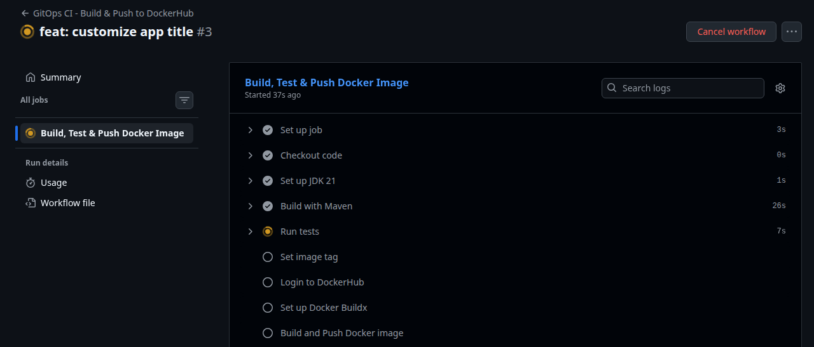
   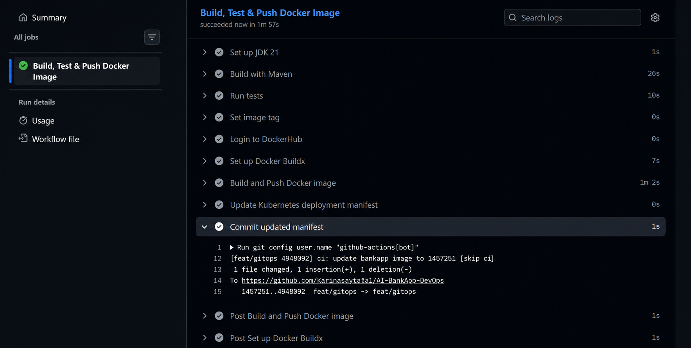
   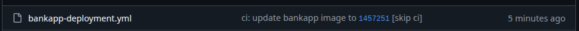

**Watch ArgoCD sync:**
```bash
argocd app get bankapp --refresh
argocd app wait bankapp
```

Or watch in the ArgoCD UI -- you will see a new sync event with the updated revision.

   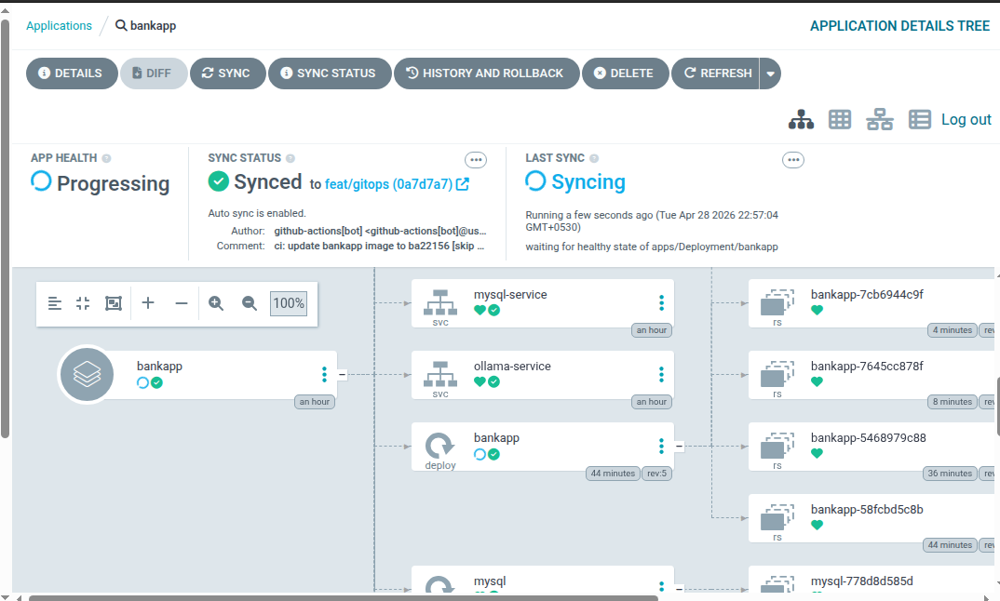

Check the pods:
```bash
kubectl get pods -n bankapp -w
```

   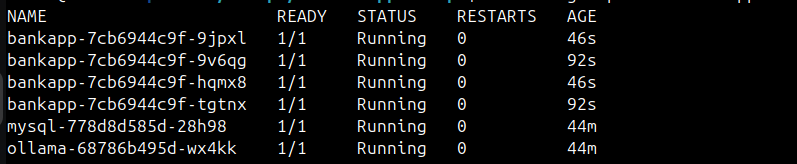

You should see a rolling update -- new pods starting with the new image while old pods terminate gracefully.

Verify the change is live:
```bash
kubectl port-forward svc/bankapp-service -n bankapp 8080:8080
```

   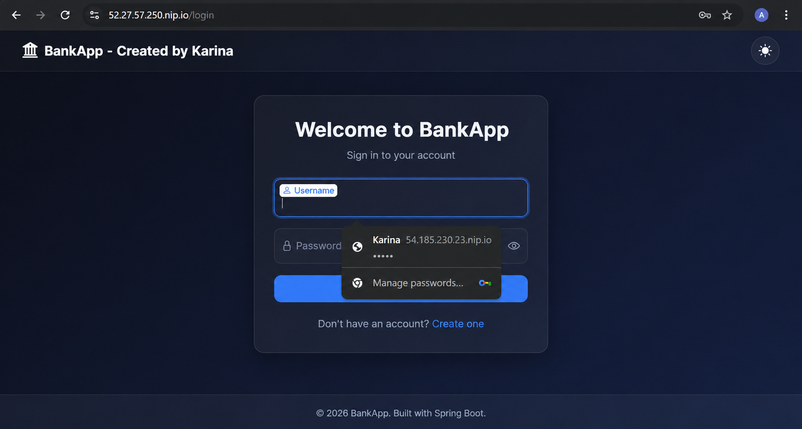

Open `http://localhost:8080` and confirm your title change is visible.

**You just completed a full GitOps cycle:** code change -> CI builds image -> updates manifest -> ArgoCD deploys to production. Zero manual intervention.

---

## Task 4: Test Drift Detection and Recovery
GitOps means the cluster must always match Git. Test what happens when someone makes unauthorized changes.

**Scenario 1 -- Someone scales down the app directly:**
```bash
kubectl scale deployment bankapp -n bankapp --replicas=1
```

   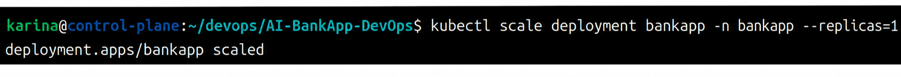

Check ArgoCD:
```bash
argocd app get bankapp
```

   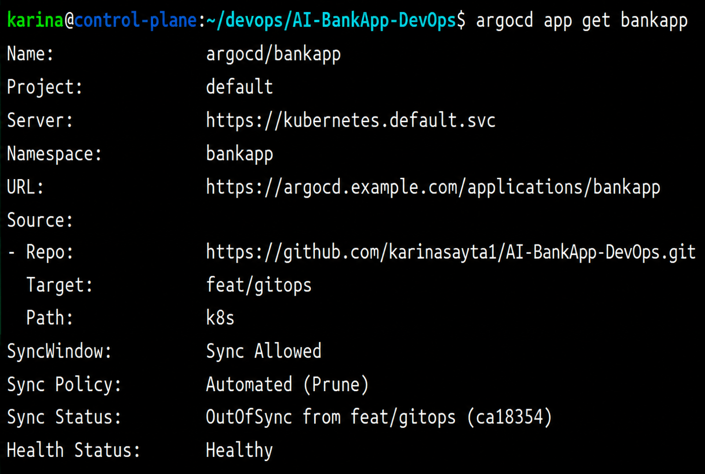

Status should show `OutOfSync`. With `selfHeal: true`, ArgoCD will correct it within 3 minutes. Monitor:
```bash
kubectl get pods -n bankapp -w
```

   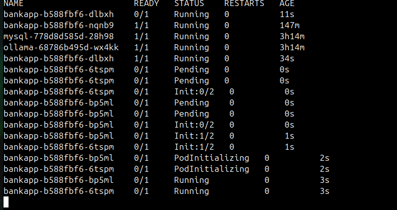

The replica count will return to 4 (or whatever the manifest specifies).

**Scenario 2 -- Someone updates the image tag directly:**
```bash
kubectl set image deployment/bankapp bankapp=nginx:latest -n bankapp
```

   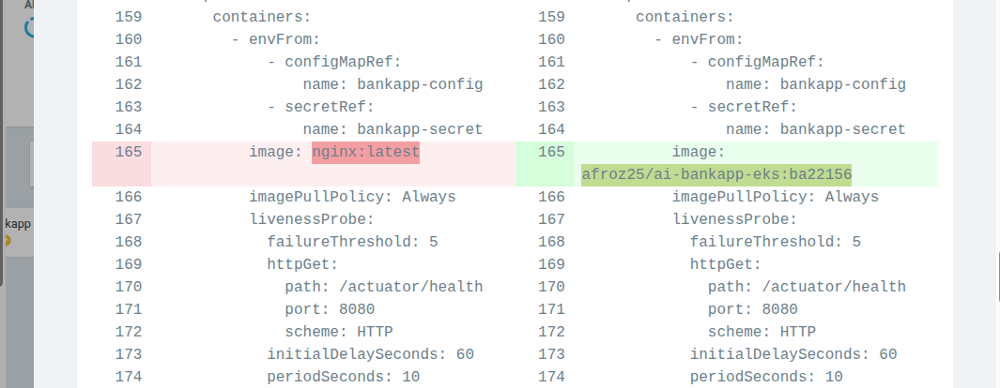
   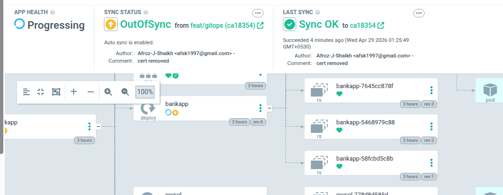
   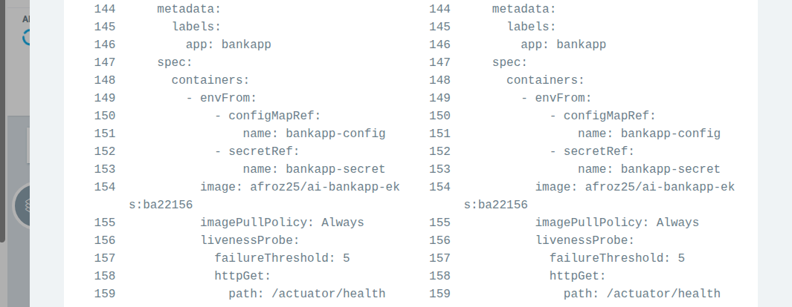
   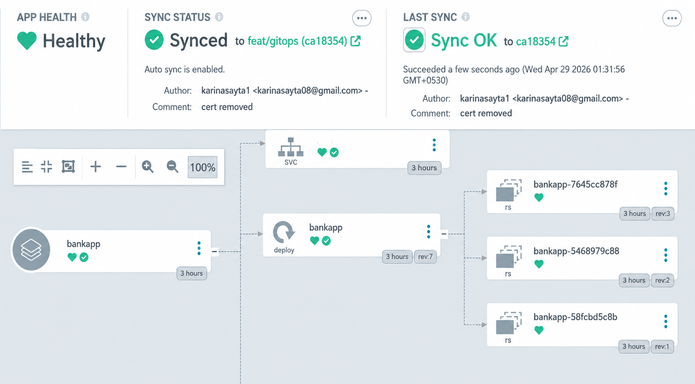

ArgoCD detects the drift and reverts it to the image tag from Git. The BankApp pods restart with the correct image.

**Scenario 3 -- Someone deletes a critical resource:**
```bash
kubectl delete service bankapp-service -n bankapp
```

   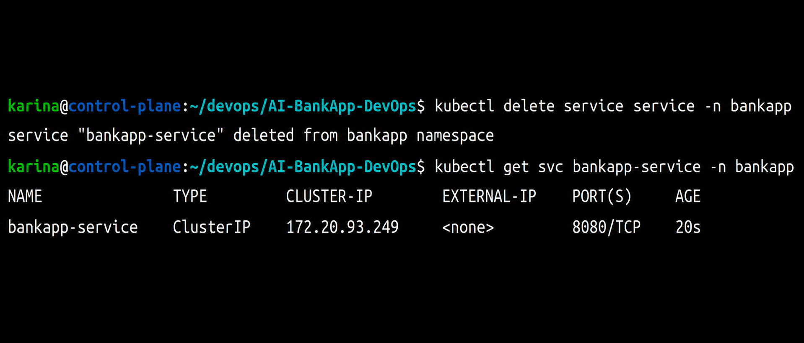

ArgoCD recreates it from Git.

**View all drift events:**
```bash
argocd app history bankapp
```

   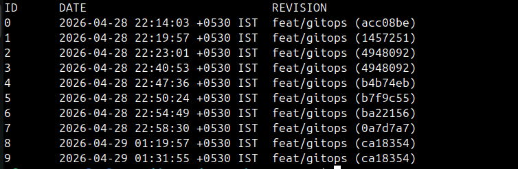

In the ArgoCD UI, click the application and look at the "Events" tab. Every self-heal action is logged with the before/after state.

   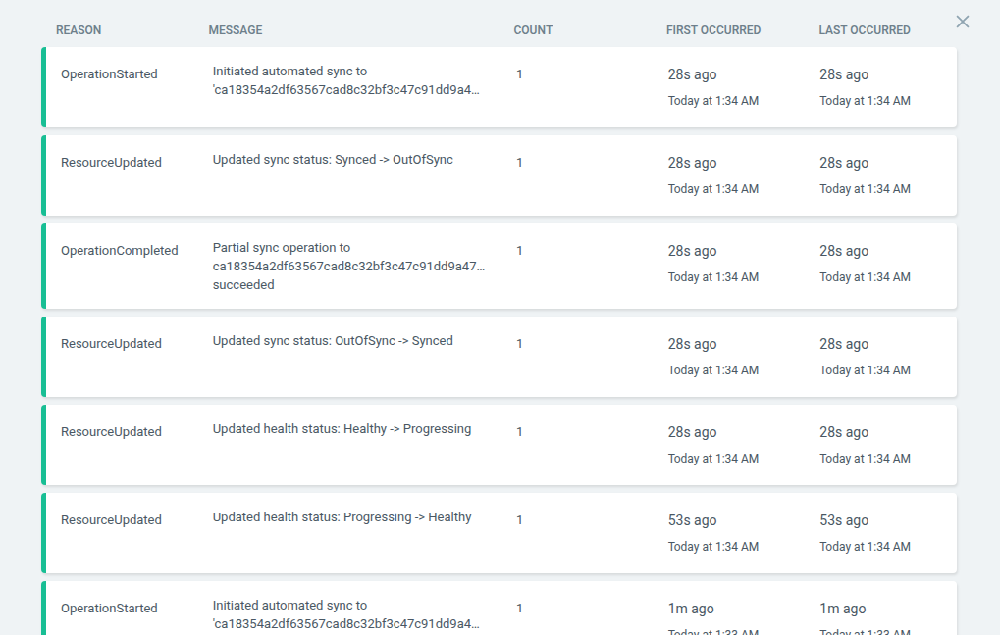

**Document:** In each scenario, how long did ArgoCD take to detect and fix the drift? What would happen if `selfHeal` was disabled?
   - It took 1-3 minitues to detect and fix the drift.
   - If `selfHeal` was disabled ArgoCD would detect the drift but would not fix it automatically. We manually have to sync.

---

## Task 5: Reflect on the Complete DevOps Pipeline
Step back and look at everything you have built across the entire 90-day challenge that connects to this GitOps pipeline:

```
[Developer writes code]
    |
[Git push to GitHub]  ........... Day 22-28: Git & GitHub
    |
[GitHub Actions CI]   ........... Day 40-49: GitHub Actions
    |-- Build with Maven
    |-- Run tests
    |-- Build Docker image  ..... Day 29-37: Docker
    |-- Push to DockerHub
    |-- Update K8s manifest
    |-- Commit back to Git
    |
[ArgoCD detects change] ........ Day 84-86: GitOps
    |
[ArgoCD syncs to EKS]  ........ Day 81-83: EKS
    |-- Rolling update
    |-- Health checks pass
    |-- HPA scales as needed ... Day 78-80: Helm (HPA, values)
    |
[Prometheus scrapes metrics] ... Day 73-77: Observability
    |-- Grafana dashboards
    |-- Alerts if something breaks
    |
[App is live with zero downtime]
```

Every block in this challenge connects to the next. This is what a DevOps pipeline looks like in production.

---

## Task 6: Complete Teardown
**Delete everything. This is the end of the EKS and ArgoCD block.**

Delete ArgoCD applications:
```bash
argocd app delete bankapp --cascade -y
argocd app delete monitoring --cascade -y 2>/dev/null
argocd app delete envoy-gateway --cascade -y 2>/dev/null
argocd app delete root-app --cascade -y 2>/dev/null
```

The `--cascade` flag tells ArgoCD to delete all Kubernetes resources managed by each application.

Wait for cleanup:
```bash
kubectl get all -n bankapp 2>/dev/null
kubectl get all -n monitoring 2>/dev/null
```

   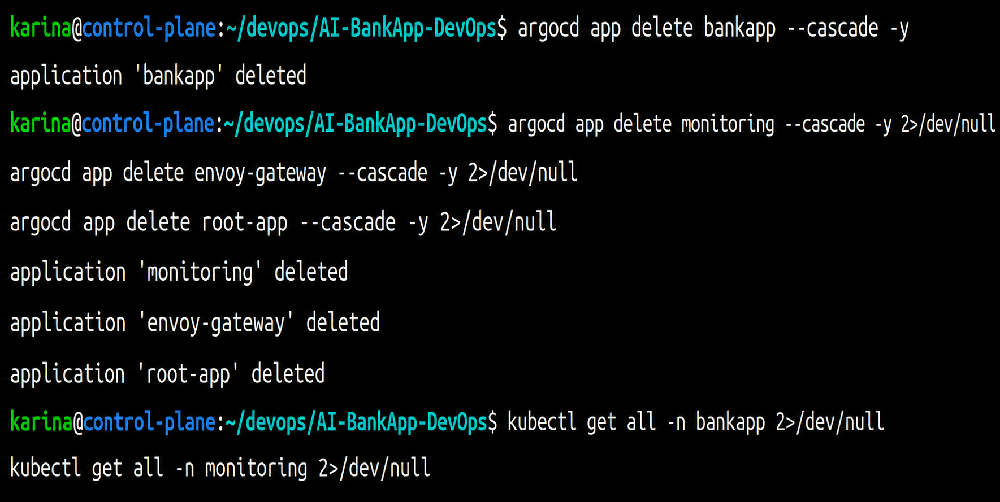

**Destroy the EKS cluster with Terraform:**
```bash
cd AI-BankApp-DevOps/terraform
terraform destroy
```

Confirm deletion (type `yes`). This takes 10-15 minutes.

**Verify in the AWS Console:**
- EKS: no clusters
- EC2: no instances, no load balancers, no EBS volumes
- VPC: the `bankapp-eks` VPC is gone
- IAM: clean up roles with `eksctl` or `bankapp-eks` in the name

   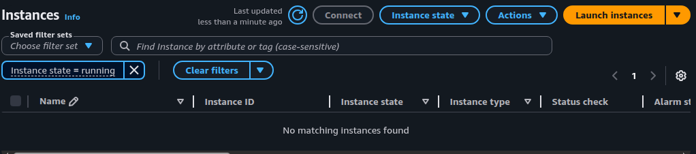
   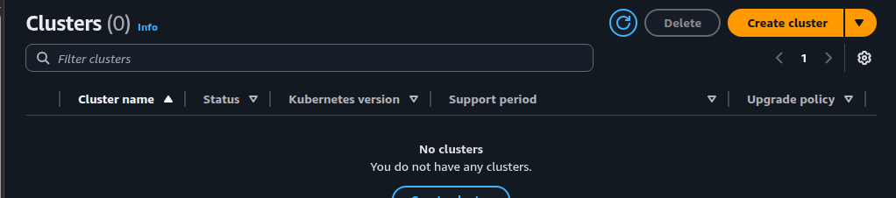
   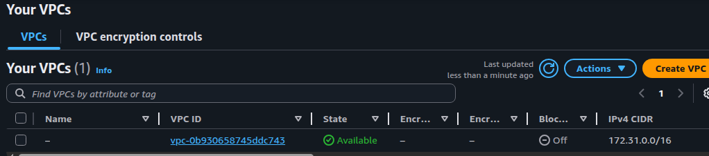
   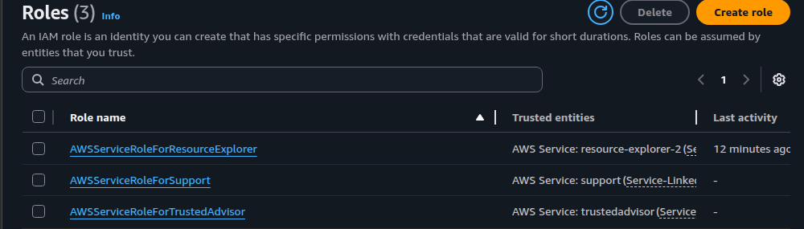

**Final cost check:** Review AWS Billing Dashboard. All EKS charges should stop within the hour.

**Map the 3-day ArgoCD journey:**

| Day | What You Built |
|-----|---------------|
| 84 | ArgoCD setup, first GitOps deploy, self-healing |
| 85 | Sync waves, rollbacks, App of Apps, notifications, RBAC |
| 86 | Full CI/CD pipeline, code-to-production, drift detection, teardown |

---

- The complete GitOps pipeline diagram (code -> CI -> Git -> ArgoCD -> EKS)

   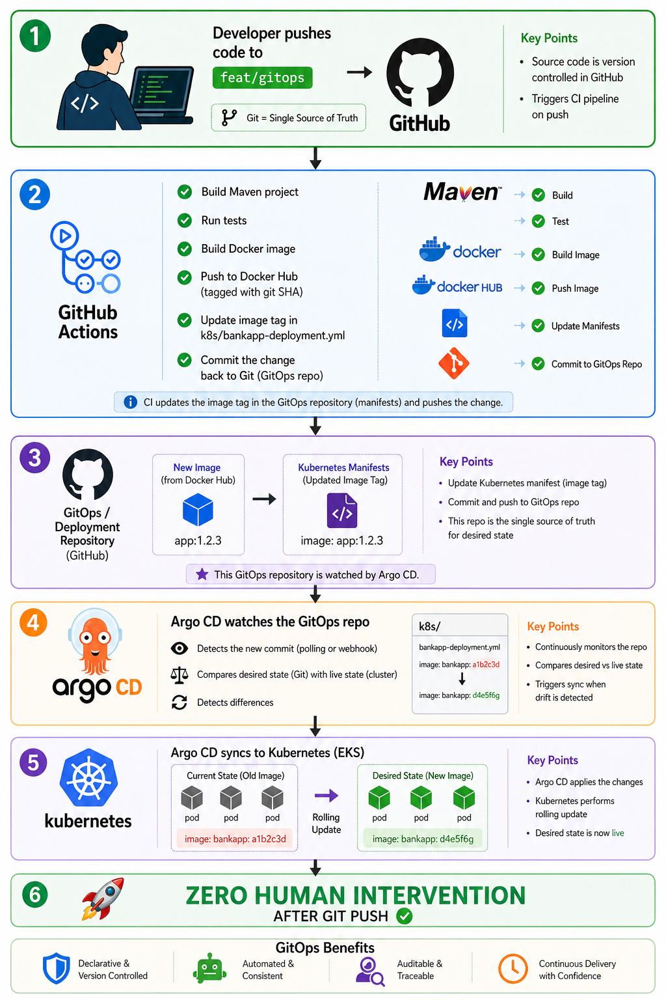

- GitHub Actions workflow explained step by step

```yml
#label
name: GitOps CI - Build & Push to DockerHub

#trigger conditions: runs automatically when code is pushed to branch feat/gitops and #changes are in src/, pom.xml, dockerfile also manual trigger
on:
push:
  branches: [feat/gitops]
  paths:
    - 'src/**'
    - 'pom.xml'
    - 'Dockerfile'
workflow_dispatch:

#give write permissions
permissions:
contents: write

#environemnt variable used later
env:
DOCKERHUB_REPO: afroz25/ai-bankapp-eks

#Creates a job named build-and-push runs on a fresh Ubuntu virtual machine
jobs:
build-and-push:
  name: Build, Test & Push Docker Image
  runs-on: ubuntu-latest

  steps:
    #checkout code
    - name: Checkout code
      uses: actions/checkout@v4

    #setup jdk 
    - name: Set up JDK 21
      uses: actions/setup-java@v4
      with:
        java-version: '21'
        distribution: 'temurin'
        cache: 'maven'

    #build application:Cleans previous builds,Compiles code,Packages into JAR,Skips tests 
    - name: Build with Maven
      run: ./mvnw clean package -DskipTests -B

    #Executes unit tests, even if tests fail → workflow continues 
    - name: Run tests
      run: ./mvnw test -B
      continue-on-error: true

    #generate short tag of current commit, image is tagged with this id later
    - name: Set image tag
      id: tag
      run: echo "sha_short=$(git rev-parse --short HEAD)" >> "$GITHUB_OUTPUT"

    #login to docker hub using github secrets
    - name: Login to DockerHub
      uses: docker/login-action@v3
      with:
        username: ${{ secrets.DOCKERHUB_USERNAME }}
        password: ${{ secrets.DOCKERHUB_TOKEN }}

    #Enables advanced Docker build features required for caching and multi-platform builds
    - name: Set up Docker Buildx
      uses: docker/setup-buildx-action@v3

    #Builds Docker image from Dockerfile, Tags it: latest, Pushes to DockerHub
    #Uses GitHub cache for faster builds
    - name: Build and Push Docker image
      uses: docker/build-push-action@v6
      with:
        context: .
        push: true
        tags: |
          ${{ env.DOCKERHUB_REPO }}:latest
          ${{ env.DOCKERHUB_REPO }}:${{ steps.tag.outputs.sha_short }}
        cache-from: type=gha
        cache-to: type=gha,mode=max

    #Updates deployment YAML, replaces old image tag with new SHA tag
    - name: Update Kubernetes deployment manifest
      run: |
        sed -i "s|image: ${{ env.DOCKERHUB_REPO }}:.*|image: ${{ env.DOCKERHUB_REPO }}:${{ steps.tag.outputs.sha_short }}|" k8s/bankapp-deployment.yml

    #Configures Git identity, adds modified file
    #Commits the change with `[skip ci]` to avoid re-triggering
    - name: Commit updated manifest
      run: |
        git config user.name "github-actions[bot]"
        git config user.email "github-actions[bot]@users.noreply.github.com"
        git add k8s/bankapp-deployment.yml
        git diff --staged --quiet || git commit -m "ci: update bankapp image to ${{ steps.tag.outputs.sha_short }} [skip ci]"
        git push
```

- Key takeaways from the 3-day GitOps block
   - GitHub is single source of truth
   - Multiple application deployed using app of apps
   - Sync wave annotation orders to be given carefully
   - Complete pplication deployed using single `kubectl apply` command
   - ArgoCD keeps all applicaitons in check
   - `selfHeal` automatically syncs if any drift detected

---
