# Day 88 -- Multi-Tool Agents, MCP, and CI/CD Analyzer

## Task 1: Build the Multi-Tool DevOps Agent (Module 3)
The Docker agent had 3 tools. Now add 3 Kubernetes tools to the same agent.

**Set up a Kind cluster with a broken pod:**
```bash
kind create cluster --name devops-demo
kubectl apply -f module-3/broken_pod.yaml
```

   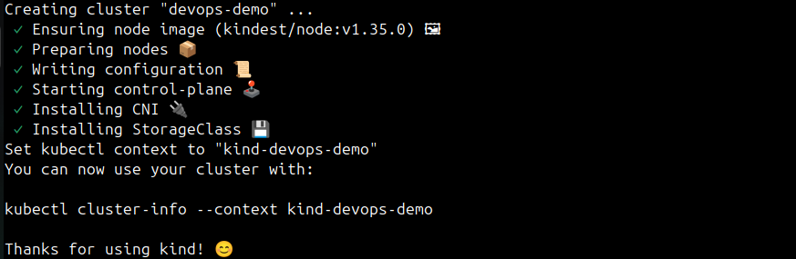
   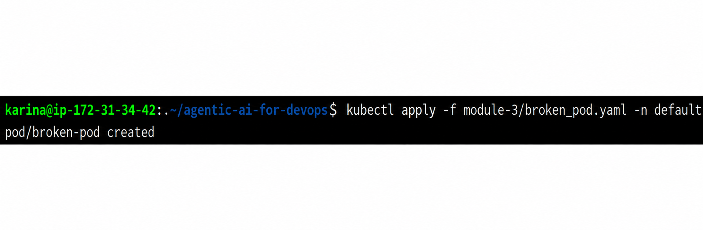

The `broken_pod.yaml` deploys a pod that crashes immediately:
```yaml
apiVersion: v1
kind: Pod
metadata:
  name: broken-pod
  namespace: default
spec:
  containers:
  - name: app
    image: nginx:alpine
    command: ["sh", "-c", "echo 'app starting...' && sleep 2 && exit 1"]
```

Also create a broken Docker container:
```bash
docker run -d --name broken-container nginx:alpine sh -c "echo 'container starting...' && sleep 2 && exit 1"
```

   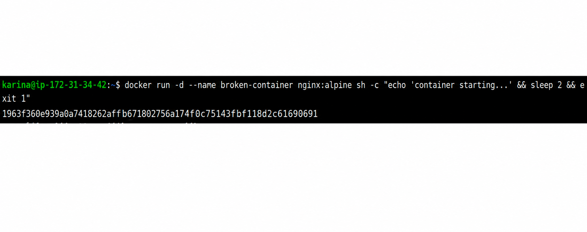

**Study `module-3/agent.py`** -- it has 6 tools now:

Docker tools (from Day 87):
- `list_containers()` -- `docker ps -a`
- `get_logs(container_name)` -- `docker logs`
- `inspect_container(container_name)` -- `docker inspect`

Kubernetes tools (new):
```python
@tool
def list_pods(namespace: str = "default") -> str:
    """List all pods in a Kubernetes namespace with their status."""
    result = subprocess.run(
        ["kubectl", "get", "pods", "-n", namespace],
        capture_output=True, text=True,
    )
    return result.stdout or result.stderr

@tool
def describe_pod(pod_name: str, namespace: str = "default") -> str:
    """Get detailed info about a Kubernetes pod including events and conditions."""
    result = subprocess.run(
        ["kubectl", "describe", "pod", pod_name, "-n", namespace],
        capture_output=True, text=True,
    )
    return result.stdout or result.stderr

@tool
def get_events(namespace: str = "default") -> str:
    """Get recent Kubernetes events in a namespace (useful for troubleshooting)."""
    result = subprocess.run(
        ["kubectl", "get", "events", "-n", namespace, "--sort-by=.lastTimestamp"],
        capture_output=True, text=True,
    )
    return result.stdout or result.stderr
```

**Run it:**
```bash
python3 module-3/agent.py
```

Ask questions that span both domains:
```
> What's broken across Docker and Kubernetes?
> Why is broken-pod crashing?
> Are there any unhealthy containers on Docker?
> Describe the events in the default namespace
```

   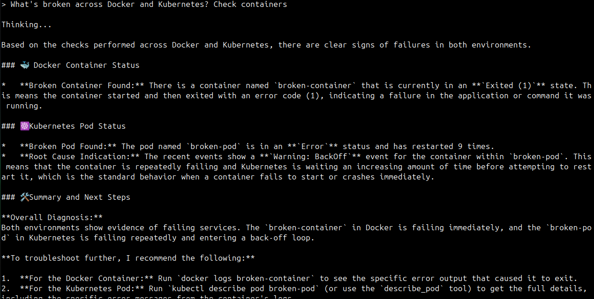
   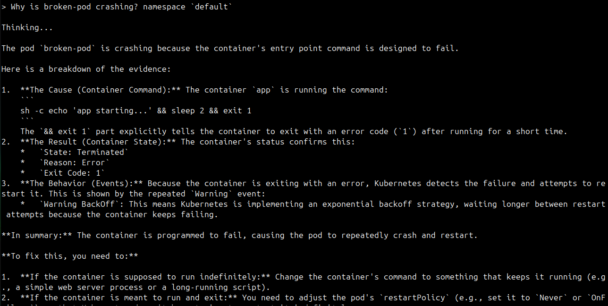
   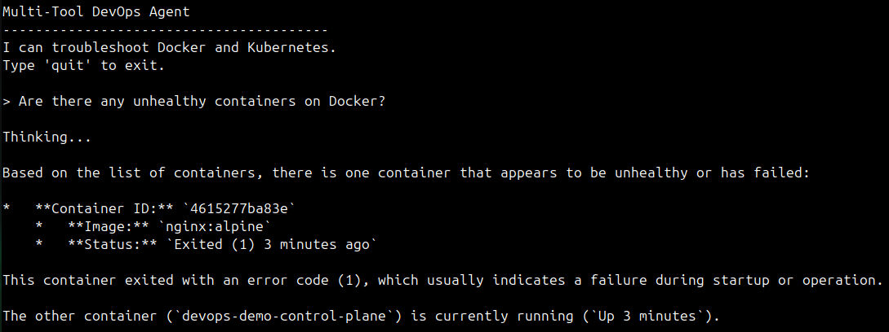
   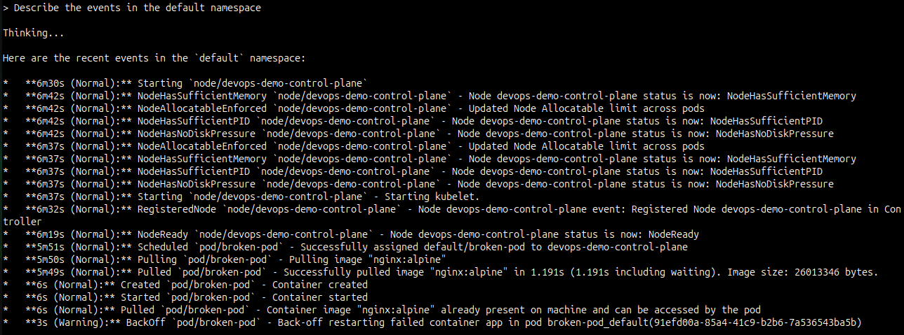

The agent decides which tools to use based on the question. Ask about Docker -- it uses Docker tools. Ask about pods -- it switches to Kubernetes tools. Ask about both -- it uses all of them.

**This is the power of the ReAct pattern:** One agent, many tools, one brain that decides what to use.

---

## Task 2: Understand the Model Context Protocol (MCP)
MCP is an open standard (created by Anthropic) for connecting AI models to external tools and data sources. Instead of writing tools inside your agent code, you expose them via MCP and any compatible client can use them.

**Why MCP matters for DevOps:**

| Without MCP | With MCP |
|------------|---------|
| Tools are locked to one framework (LangChain) | Tools work with any MCP client |
| Every AI client re-implements Docker/K8s tools | Write once, use everywhere |
| Tool access tied to the agent code | Tools exposed as a discoverable service |

**MCP-compatible clients:**
- Claude Desktop
- VS Code (GitHub Copilot)
- Cursor
- Claude Code (the CLI you might already be using)
- Any LangChain agent via `langchain-mcp-adapters`

**The architecture:**
```
[MCP Server]                    [MCP Clients]
  |                                  |
  |-- list_pods()                    |-- Claude Desktop
  |-- describe_pod()      <--->      |-- VS Code Copilot
  |-- get_events()                   |-- Your Python agent
  |                                  |-- Any MCP client
  |
  (exposes tools via stdio/HTTP)
```

---

## Task 3: Build and Use the MCP Server (Module 3)
Study `module-3/mcp_server.py`:

```python
from fastmcp import FastMCP

mcp = FastMCP("Kubernetes Tools")

@mcp.tool
def list_pods(namespace: str = "default") -> str:
    """List all pods in a Kubernetes namespace with their status."""
    result = subprocess.run(
        ["kubectl", "get", "pods", "-n", namespace],
        capture_output=True, text=True,
    )
    return result.stdout or result.stderr

@mcp.tool
def describe_pod(pod_name: str, namespace: str = "default") -> str:
    """Get detailed info about a Kubernetes pod including events and conditions."""
    # ...

@mcp.tool
def get_events(namespace: str = "default") -> str:
    """Get recent Kubernetes events in a namespace."""
    # ...

if __name__ == "__main__":
    mcp.run()
```

**Key difference from LangChain tools:**
- `@mcp.tool` instead of `@tool` -- registered with the MCP server
- `FastMCP("Kubernetes Tools")` -- creates a named MCP server
- `mcp.run()` -- starts the server (stdio transport by default)
- Any MCP client can discover and call these tools

**Now study `module-3/agent_with_mcp.py`** -- the MCP client:

```python
from langchain_mcp_adapters.client import MultiServerMCPClient

async def main():
    client = MultiServerMCPClient({
        "docker-mcp": {
            "transport": "stdio",
            "command": "python",
            "args": ["mcp_server.py"]
        }
    })

    tools = await client.get_tools()    # Dynamically discovers tools from MCP
    llm = ChatOllama(model="gemma4", temperature=0.8)
    agent = create_agent(llm, tools)    # Same ReAct agent, but tools come from MCP
```

The agent does not define tools locally. It connects to the MCP server and discovers them at runtime.

**Run the MCP agent:**
```bash
cd module-3
python3 agent_with_mcp.py
```

   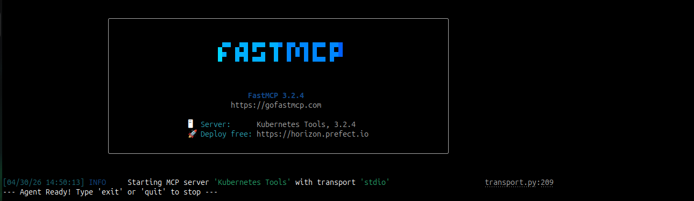

Ask the same Kubernetes questions:
```
> List the pods in my cluster
> Why is broken-pod crashing?
> What events happened recently?
```
   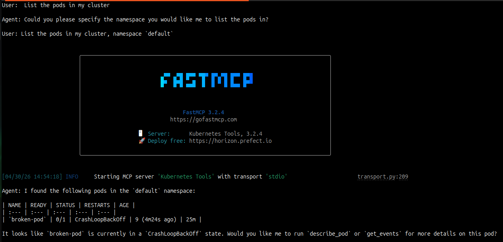
   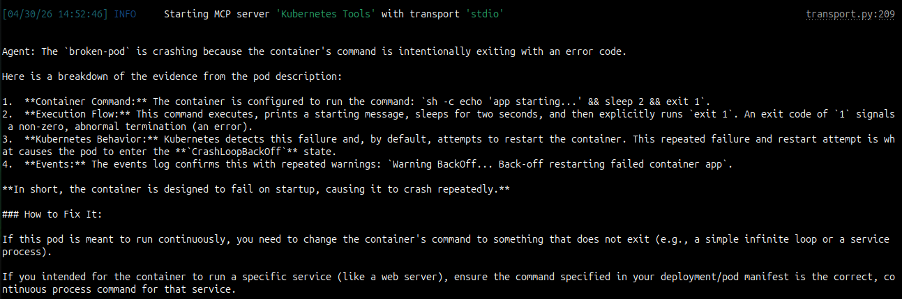
   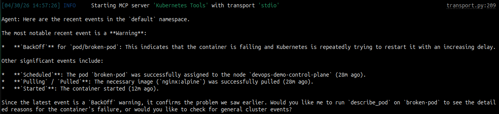

Same result as before, but the tools are served via MCP instead of being hardcoded in the agent.

**Configure Claude Desktop with your MCP server** (if you have Claude Desktop installed):

Add to `~/Library/Application Support/Claude/claude_desktop_config.json` (macOS):
```json
{
  "mcpServers": {
    "kubernetes-tools": {
      "command": "python3",
      "args": ["/full/path/to/agentic-ai-for-devops/module-3/mcp_server.py"]
    }
  }
}
```

Restart Claude Desktop. Now you can ask Claude: "List the pods in my cluster" and it will call your MCP server's `list_pods()` tool.

---

## Task 4: Build the CI/CD Failure Analyzer (Module 6)
The same agent pattern works for CI/CD. This agent uses the `gh` CLI to diagnose GitHub Actions failures.

**Prerequisites:**
```bash
# Authenticate GitHub CLI
gh auth login
```

**Study `module-6/ci_analyzer.py`:**

Three tools:
```python
@tool
def list_workflow_runs(status: str = "failure") -> str:
    """List recent GitHub Actions workflow runs. Use status='failure' for failed runs."""
    result = subprocess.run(
        ["gh", "run", "list", "--status", status, "--limit", "5"],
        capture_output=True, text=True,
    )
    return result.stdout or result.stderr

@tool
def get_failed_logs(run_id: str) -> str:
    """Get the failed step logs from a GitHub Actions run. Pass the run ID."""
    result = subprocess.run(
        ["gh", "run", "view", run_id, "--log-failed"],
        capture_output=True, text=True,
    )
    output = result.stdout + result.stderr
    if len(output) > 5000:
        output = output[:5000] + "\n\n[...truncated, showing first 5000 chars]"
    return output

@tool
def get_workflow_file(workflow_name: str) -> str:
    """Read a GitHub Actions workflow YAML file. Pass the filename like 'ci.yml'."""
    import pathlib
    path = pathlib.Path(f".github/workflows/{workflow_name}")
    if path.exists():
        return path.read_text()
    return f"File not found: {path}"
```

**Note the log truncation** in `get_failed_logs` -- LLMs have token limits. You cannot send 100KB of CI logs. Truncating to 5000 characters keeps it within bounds while preserving the most important information (the failed step output).

**Run it inside the AI-BankApp repo** (which has GitHub Actions):
```bash
cd AI-BankApp-DevOps
python3 ../agentic-ai-for-devops/module-6/ci_analyzer.py
```

Ask:
```
> What failed in my last CI run?
> Show me the recent workflow runs
> Read the gitops-ci.yml workflow file and explain what it does
```

   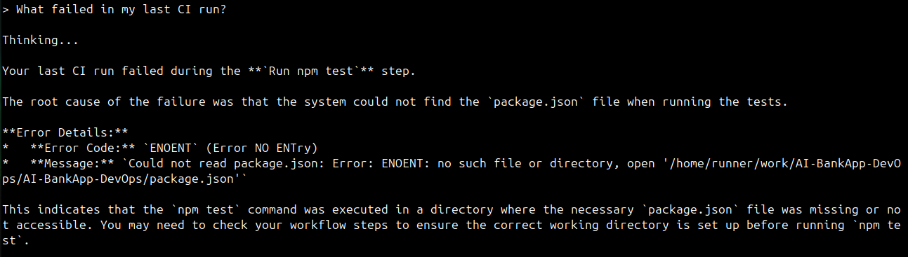
   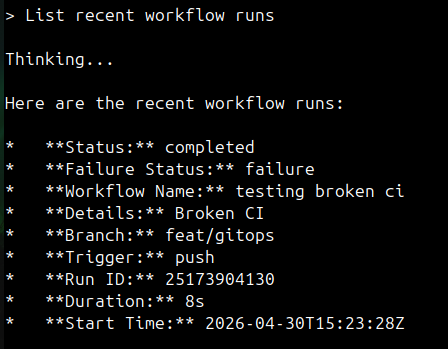
   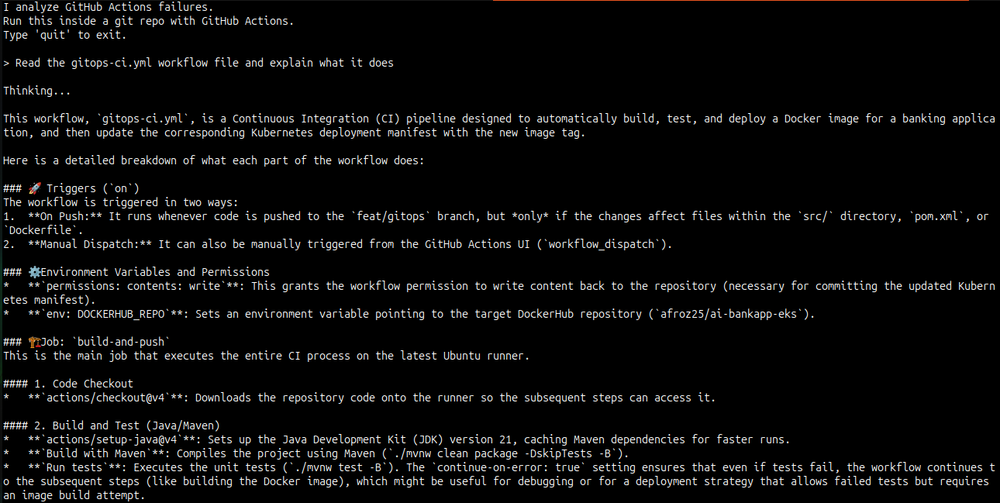
   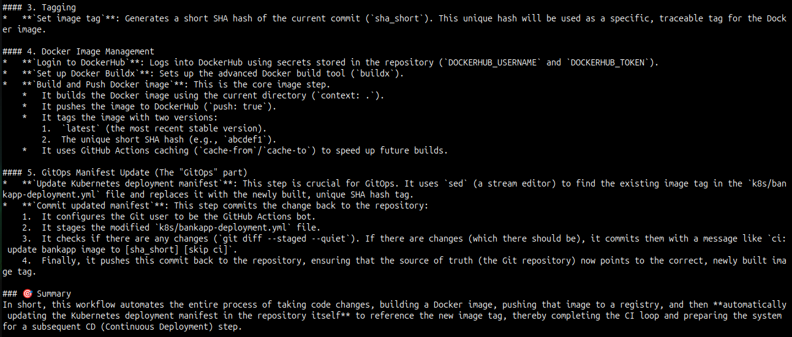

The agent lists failed runs, fetches their logs, reads the workflow file, and explains the root cause.

**Try creating a deliberately broken workflow to test it:**

Create `.github/workflows/broken-ci.yml` in a test repo:
```yaml
name: Broken CI
on: [push]
jobs:
  build:
    runs-on: ubuntu-latest
    steps:
      - uses: actions/checkout@v4
      - run: npm test    # Will fail -- no package.json!
```

Push it, let it fail, then ask the agent: "Why did broken-ci fail?"

---

## Task 5: Build Your Own Tool
The pattern is now clear. Any CLI command can be a tool. Build one of these:

**Option A -- Terraform Plan Analyzer:**
```python
@tool
def terraform_plan() -> str:
    """Run terraform plan and return the output showing what would change."""
    result = subprocess.run(
        ["terraform", "plan", "-no-color"],
        capture_output=True, text=True,
        cwd="/path/to/your/terraform/project"
    )
    output = result.stdout + result.stderr
    if len(output) > 5000:
        output = output[:5000] + "\n[...truncated]"
    return output
```

**Option B -- AWS Resource Checker:**
```python
@tool
def list_ec2_instances() -> str:
    """List all EC2 instances with their state, type, and name."""
    result = subprocess.run(
        ["aws", "ec2", "describe-instances",
         "--query", "Reservations[*].Instances[*].[InstanceId,State.Name,InstanceType,Tags[?Key=='Name'].Value|[0]]",
         "--output", "table"],
        capture_output=True, text=True,
    )
    return result.stdout or result.stderr
```

**Option C -- Log Searcher:**
```python
@tool
def search_logs(keyword: str, namespace: str = "default") -> str:
    """Search for a keyword in the logs of all pods in a namespace."""
    pods = subprocess.run(
        ["kubectl", "get", "pods", "-n", namespace, "-o", "name"],
        capture_output=True, text=True,
    )
    results = []
    for pod in pods.stdout.strip().split("\n"):
        if not pod:
            continue
        logs = subprocess.run(
            ["kubectl", "logs", pod, "-n", namespace, "--tail=100"],
            capture_output=True, text=True,
        )
        if keyword.lower() in logs.stdout.lower():
            results.append(f"{pod}: found '{keyword}'")
    return "\n".join(results) if results else f"No pods contain '{keyword}' in their logs"
```

Add your tool to any agent, run it, and ask a question that triggers it.

   [My Terraform Tool](terraform_plan_analyzer.py)

   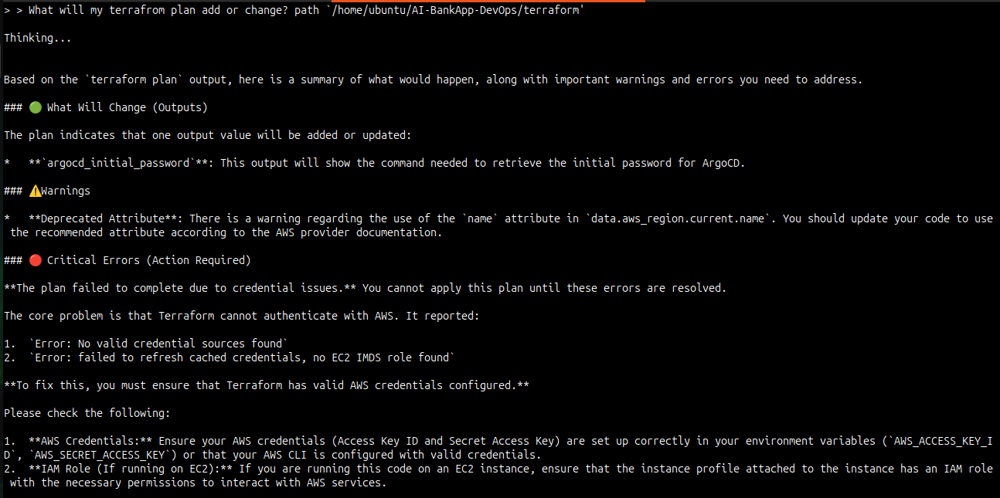

   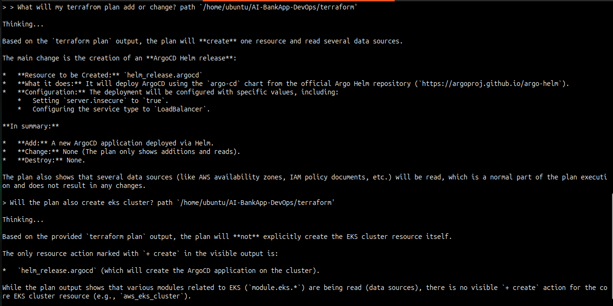

**Document:** Which tool did you build? How did the agent decide when to use it?
   - I created `terrafrom` tool that Run terraform plan and return the output showing what would change.
   - It detected I don't have aws cli congifured so it also suggested to configure aws first, to create infra using terraform.
   - But it is still not perfect, will need to add more tools to it so that it can properly read .tf files and give correct answers.

---

## Task 6: Clean Up
```bash
# Delete Kind cluster
kind delete cluster --name devops-demo

# Remove broken container
docker rm -f broken-container 2>/dev/null

# Deactivate Python venv (if needed later)
deactivate
```

   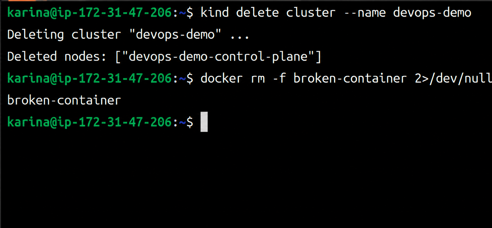

**Map what you built today:**

| Module | What | Tools | Pattern |
|--------|------|-------|---------|
| 3 (agent.py) | Multi-tool agent | 3 Docker + 3 K8s | LangChain ReAct |
| 3 (mcp_server.py) | MCP server | 3 K8s tools via MCP | FastMCP |
| 3 (agent_with_mcp.py) | MCP client agent | Tools from MCP server | LangChain + MCP adapter |
| 6 | CI/CD analyzer | 3 GitHub Actions tools | LangChain ReAct |

**The pattern is always the same:**
1. Define tools that wrap CLI commands
2. Create an LLM instance
3. Create a ReAct agent
4. The agent reasons about the question, calls tools, reads output, answers

---

- The multi-tool agent architecture (6 tools across 2 domains)

```chart
                    ┌────────────┐
                    │   User     │
                    │ (asks a    │
                    │ question)  │
                    └──────▲─────┘
                           │
                           │
                           ▼
                    ┌────────────┐
                    │   LLM      │
                    │ (ChatOllama│
                    │ analyzes   │
                    │ intent)    │
                    └──────▲─────┘
                           │
                           │
                           ▼
                    ┌────────────────────────┐
                    │   Agent Core           │
                    │ (decides which domain  │
                    │  tool to use)          │
                    └──────┬─────────────────┘
                           │
                     ┌─────┴───────┐
                     │             │
                     ▼             ▼
                Docker Tools   Kubernetes Tools
                (list, logs,   (pods, describe,
                inspect)       events)
                     │             │
                     └─────┬───────┘
                           │
                           ▼
                    ┌────────────┐
                    │  Response  │
                    │ (diagnosis │
                    │  or output)│
                    └────────────┘
```

- MCP explained: server, client, protocol, why it matters
   - MCP server :
      - MCP server is like tool hub, it hosts and exposes tools that an AI client can call
      - Example: mcp_server.py exposes Kubernetes tools like list_pods, describe_pod, etc.
      - The server defines what tools exists and how they are invoked
      - It comminicates via a transport layer (usually stdio, sockets, or HTTP).
   - MCP client :
      - The client is AI agent or model that connects to the server and uses tools.
      - Example: Our local agent using FastMCP, Claude desktop.
      - It discovers available tools, decides which to use and sends requests.
   - Protocol :
      - The "Protocol" itself is the set of rules that governs how the Client and Server speak to each other.
      - Standard Language: It uses JSON-RPC 2.0
      - Transport Methods:
         - STDIO (Standard Input/Output): Used when the server is running locally on your computer. It’s fast and simple.
         - SSE (Server-Sent Events) / HTTP: Used when the server is hosted remotely (in the cloud).

- Tool pattern template that works for any CLI
```python
@tool
def tool_name() -> str:
    """Docstring that specifies what the tool does."""
    result = subprocess.run(
        ["command"],
        capture_output=True, text=True,
    )
    return result.stdout or result.stderr
```                

---
