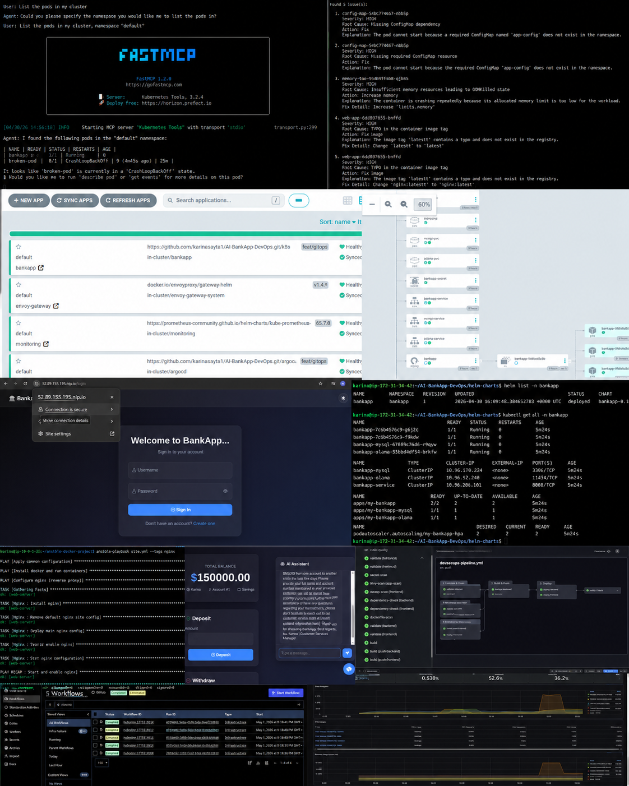

# Day 90 -- Grand Finale: The Complete DevOps Journey

## The Full 90-Day Map

```
LINUX FUNDAMENTALS (Days 1-13)
  Commands, processes, files, permissions, LVM
  "The foundation. Every DevOps tool runs on Linux."
         |
NETWORKING (Days 14-15)
  DNS, IP, subnets, ports
  "How machines talk to each other."
         |
SHELL SCRIPTING (Days 16-21)
  Bash basics, functions, projects
  "Automating what you'd otherwise type by hand."
         |
GIT & GITHUB (Days 22-28)
  Branching, advanced git, GitHub CLI
  "Version control. The backbone of everything that follows."
         |
DOCKER (Days 29-37)
  Images, Dockerfile, volumes, networking, Compose, multi-stage builds
  "Packaging applications so they run the same everywhere."
         |
CI/CD & GITHUB ACTIONS (Days 38-49)
  YAML, workflows, triggers, runners, secrets, DevSecOps
  "Automating build, test, and deploy on every push."
         |
KUBERNETES (Days 50-58)
  Pods, Deployments, Services, Namespaces, RBAC
  "Orchestrating containers at scale."
         |
TERRAWEEK (Days 59-67)
  Terraform, providers, state, modules, workspaces
  "Infrastructure as Code. Provision cloud resources declaratively."
         |
ANSIBLE (Days 68-72)
  Inventory, playbooks, roles, templates, Vault
  "Configuration management. Keep servers in the desired state."
         |
OBSERVABILITY (Days 73-77)
  Prometheus, Grafana, Loki, Promtail, OpenTelemetry, alerting
  "The three pillars: metrics, logs, traces. Know WHY things break."
         |
HELM (Days 78-80)
  Charts, templates, values, subcharts, multi-env deployment
  "Package manager for Kubernetes. One chart, many environments."
         |
AMAZON EKS (Days 81-83)
  Terraform for EKS, Gateway API, EBS storage, IRSA, HPA
  "Production-grade managed Kubernetes on AWS."
         |
ARGOCD & GITOPS (Days 84-86)
  GitOps principles, ArgoCD, sync strategies, App of Apps, CI/CD pipeline
  "Git is the single source of truth. The cluster always matches the repo."
         |
AGENTIC AI FOR DEVOPS (Days 87-89)
  LLM agents, ReAct pattern, MCP, KubeHealer, Temporal
  "AI that diagnoses and fixes infrastructure autonomously."
         |
        YOU ARE HERE (Day 90)
```

---

## Task 1: The End-to-End Pipeline
Trace a single code change through every tool you learned:

```
1. A developer writes code on a Linux machine (Days 1-13)
   using shell scripts (Days 16-21) and Git (Days 22-28)

2. They push to GitHub, which triggers GitHub Actions (Days 40-49)

3. The CI pipeline builds a Docker image (Days 29-37)
   and pushes it to DockerHub

4. The pipeline updates the Kubernetes manifest in Git
   with the new image tag

5. ArgoCD (Days 84-86) detects the change and syncs
   to an EKS cluster (Days 81-83)

6. The EKS cluster, provisioned by Terraform (Days 59-67)
   and configured by Ansible (Days 68-72), runs the app

7. Helm (Days 78-80) manages the deployment with
   environment-specific values

8. Prometheus, Grafana, and Loki (Days 73-77) monitor
   metrics, logs, and traces

9. If something breaks, an AI agent (Days 87-89)
   diagnoses the issue and proposes a fix

10. The fix goes through Git, ArgoCD syncs it,
    and the cycle continues
```

Every single block connects to the next. Nothing was learned in isolation.

---

## Task 2: What You Built with the AI-BankApp
The AI-BankApp (https://github.com/TrainWithShubham/AI-BankApp-DevOps) tied together the last 13 days:

| Day | What You Did with the AI-BankApp |
|-----|--------------------------------|
| 78 | Deployed its MySQL dependency via Helm chart |
| 79 | Converted its 12 raw K8s manifests into a Helm chart |
| 80 | Created dev/staging/prod values, hooks, CI/CD integration |
| 81 | Provisioned EKS using its `terraform/` configs |
| 82 | Set up Gateway API, EBS storage, session persistence from its `k8s/` manifests |
| 83 | Full production deployment with monitoring |
| 84 | Deployed via ArgoCD using its `argocd/application.yml` |
| 85 | Added sync waves, App of Apps, RBAC |
| 86 | Wired its GitHub Actions pipeline for end-to-end GitOps |

One real-world project. Every tool applied to it.

---

## Task 3: Skills Inventory
Rate yourself on each skill. Be honest -- this is for you, not anyone else.

| Skill | Days | Confidence (1-5) |
|-------|------|------------------|
| Linux command line | 1-13 | 5 |
| Shell scripting | 16-21 | 3 |
| Git & GitHub | 22-28 | 5 |
| Docker | 29-37 | 5 |
| CI/CD (GitHub Actions) | 38-49 | 5 |
| Kubernetes | 50-58 | 4 |
| Terraform | 59-67 | 4 |
| Ansible | 68-72 | 4 |
| Observability (Prometheus, Grafana, Loki) | 73-77 | 3 |
| Helm | 78-80 | 3 |
| Amazon EKS | 81-83 | 3 |
| ArgoCD / GitOps | 84-86 | 3 |
| Agentic AI for DevOps | 87-89 | 3 |

For anything below 3, go back and redo that block. The day folders are still there. The tasks have not changed.

---

## Task 4: What Comes Next
DevOps does not stop at day 90. Here is what to explore next:

**Deepen what you learned:**
- Multi-cluster Kubernetes (federation, fleet management)
- Advanced Terraform (custom providers, Terragrunt, drift detection)
- Service mesh (Istio, Linkerd)
- Secrets management (HashiCorp Vault, AWS Secrets Manager, External Secrets Operator)
- Database operations (backups, migrations, blue-green database deployments)
- Chaos engineering (Litmus, Chaos Monkey)
- FinOps (cloud cost optimization)

**Certifications to pursue:**
- AWS Certified Solutions Architect
- Certified Kubernetes Administrator (CKA)
- Certified Kubernetes Application Developer (CKAD)
- HashiCorp Terraform Associate
- GitHub Actions Certification

**Build a portfolio project:**
Take everything from days 78-89 and build it from scratch for your own application:
1. Write an app (any language)
2. Dockerize it
3. Create a Helm chart
4. Provision EKS with Terraform
5. Deploy with ArgoCD
6. Monitor with Prometheus + Grafana
7. Set up the full GitOps CI/CD pipeline
8. Add an AI agent for troubleshooting

Put it on GitHub. Write a blog post about it. Share it on LinkedIn.

---

## Your top 5 "aha moments" from the challenge

- `Git&GitHub` was new to me, I was amazed at how cool this is - shared repo, keeping track of every commit with author details, and doesn;t create new folder for evry different version, it just stores changes efficiently using snapshots and references, making collaboration seamless and history traceable.
- `CI/CD` in comparision to `jenkis` - amaizing. No need to set up and maintain servers, you get GitHub‑hosted runners out of the box, built‑in actions for common workflows, and everything feels so easy and smooth.
- `Kubernetes` was completely new to me, and it blew my mind. Managing containers has never been this easy — just write manifests and apply. It takes care of everything: deployments, auto‑healing, and auto‑scaling, all without manual intervention.
- `Helm` makes Kubernetes even easier and more manageable. Instead of updating every manifest for different environments, you can package everything into a chart and reuse it — just swap the values file or override parameters at install time. One chart, multiple environments, simplified lifecycle.
- `ArgoCD (GitOps)` makes security stronger. No need to SSH into servers or manage credentials — it lives inside the cluster and deploys using a pull mechanism. It continuously watches for changes in Git and applies them automatically. No human intervention, no webhooks, just secure, declarative deployments.
- `Agentic AI for DevOps` is mind‑blowing right now. We can create agents tailored to resolve issues at every step of the pipeline. They don’t just detect problems — they can propose fixes, and even apply them automatically if approved. It’s like having an autonomous DevOps teammate that reasons, acts, and remediates in real time.


## The hardest day and how you pushed through it

- There were many hardest days such as - 
   - Helm : creating templates was difficult at first
   - GitOps : deploying app of appps
   - Monitoring : was not getting required labels
   - Agentic AI : my laptop configuration was not supporting AI models
   - The complete project deployment : very difficult at first, evrything was failing
- How I pushed through it
   - Consistency, kept doing it until I got results.
   - Sometimes I would sit until 6AM, troubleshooting, debugging.
   - We would often ask each other for help, sharing live screen and helping.
   - Doing 1 task at a time, solving 1 issue at a time.
   - Watching videos, reading documentation helped a lot.

## Screenshot collage: terminal outputs, Grafana dashboards, ArgoCD UI, the AI-BankApp running on EKS

   

## What you plan to learn next
- Amazon Web Setvices (AWS) in depth

## Advice for someone starting day 1 tomorrow
- `Consistency is key:` Show up every day, even if you only study for a short time. Regular practice matters more than long, irregular sessions. Small daily progress builds strong understanding over time.

`Don’t just copy-paste:` Always type commands yourself. Try changing things, break setups on purpose, and see what errors you get. This helps you understand how things actually work, not just follow steps.

`Ask for help & learn together:` The community is there to support you. Don’t stay stuck for hours—ask questions when needed. Join group study sessions to learn with others, share ideas, and solve problems faster. Most problems are common, and getting help early can save you a lot of time and frustration.

`Post your progress daily on LinkedIn:` Share what you learned each day, even if it’s small. This builds your public profile, helps you stay consistent, and shows your learning journey to others.

`Work on your GitHub profile regularly:` Keep updating your repositories, README files, and projects. Treat your GitHub like your portfolio so others can clearly see your work.

`Optimize your LinkedIn profile:` Keep your profile updated with skills, projects, and learning progress. A strong profile makes it easier for recruiters to notice you.

---

